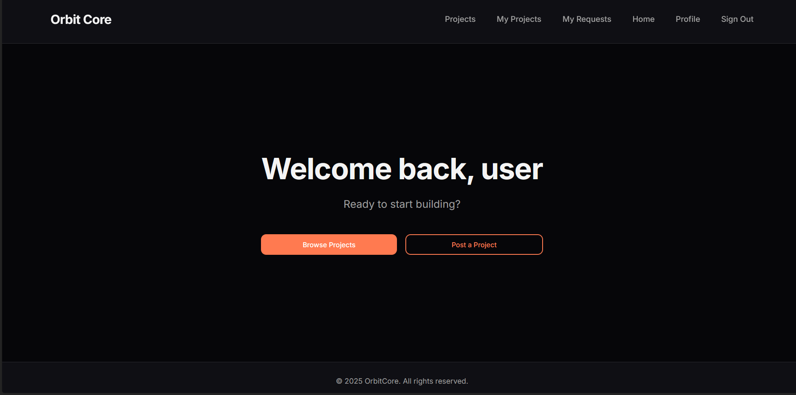

# OrbitCore

## Description

OrbitCore is a collaborative project management platform designed to connect developers and creators. The application enables users to create and manage projects, form teams, and handle join requests seamlessly. Whether you're looking to start a new project or join an existing team, OrbitCore provides the tools to bring people together and foster collaboration.

## Background

OrbitCore was built to address the common challenge of finding the right team members for projects and connecting talented individuals with opportunities that match their skills. The platform streamlines the process of project creation, team formation, and collaboration management, making it easier for developers and creators to work together effectively.

## Getting Started

### Backend Repository
🔗 [OrbitCore Backend](https://github.com/thedelusions/OrbitCore-BackEnd/tree/develop)

## Technologies Used

- **React** (v19.1.1) - Frontend library for building user interfaces
- **React Router** (v7.9.5) - Client-side routing
- **Vite** (v7.1.7) - Build tool and development server
- **JavaScript (ES6+)** - Programming language
- **CSS3** - Styling
- **JWT Authentication** - Secure user authentication
- **RESTful API** - Backend communication

## Features

- **User Authentication**: Secure login and registration with JWT tokens
- **Project Management**: Create, edit, and manage projects
- **Team Collaboration**: Form teams and manage team members
- **Request System**: Handle project join requests
- **User Profiles**: View and manage user profiles
- **Project Discovery**: Browse and search for projects to join
- **Responsive Design**: Mobile-friendly interface

## Attributions

- React - [MIT License](https://github.com/facebook/react/blob/main/LICENSE)
- React Router - [MIT License](https://github.com/remix-run/react-router/blob/main/LICENSE.md)

## Next Steps

Planned future enhancements include:

- **Real-time Notifications**: Push notifications for project updates and join requests
- **Messaging System**: In-app messaging between users
- **Project Analytics**: Dashboard with project statistics and insights
- **File Sharing**: Ability to upload and share project-related documents
- **Calendar Integration**: Project timeline and milestone tracking
- **Skills Tags System**: Tag-based skill matching for better team formation
- **Project Templates**: Pre-configured project templates for common project types
- **GitHub Integration**: Direct integration with GitHub repositories
- **Light Mode**: Theme customization options

---

**Backend Repository**: For more information about the backend API and database structure, visit the [OrbitCore Backend Repository](https://github.com/thedelusions/OrbitCore-BackEnd/tree/develop).
